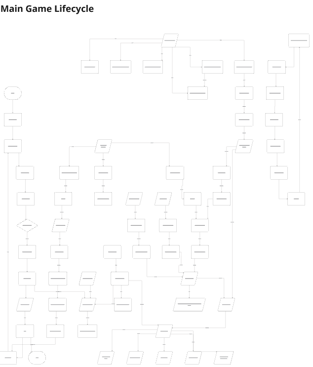
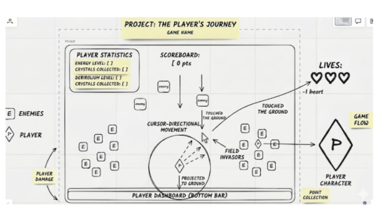

# Swarm IO

## 1. Game description

Swarm IO is a browser-based multiplayer snake game inspired by Slither.io. Players steer a growing snake around a large arena, eat food dots, avoid collisions, and try to reach the top of the leaderboard.

## 2. Entity list

- **Snake** - The player's snake and bot snakes, with `id`, `name`, `segments[]`, `angle`, `speed`, `color`, `alive`, and `score`.
- **Food** - Static dots on the map with `id`, `x`, `y`, `color`, and `value`.
- **Bot** - Extends `Snake` and adds an AI state machine with `ROAM`, `EAT`, and `EVADE`.
- **GameRoom** - Server-side room that manages snakes, food, bots, the tick loop, and WebSocket broadcasts.
- **Renderer** - Client-side class that owns the Canvas context and draws the world every frame.

## 3. Excalidraw sketch placeholder

# MiroBorad Link:
[MiroBoard:](https://miro.com/app/board/uXjVHLxZC_4=/?share_link_id=387327340845)

## 4. How to play

- **Controls** - Move the mouse to steer. The snake auto-moves continuously.
- **Objective** - Eat food to grow longer, survive, and climb the leaderboard.
- **Win condition** - There is no fixed ending; the goal is to become the longest snake.
- **Lose condition** - You die if you hit the wall, another snake, or your own body in local fallback mode.

## 5. Tech decisions

This project uses OOP. Each entity is a class because it makes the relationship between data and behavior explicit, makes the AI diary easier to explain, and maps cleanly to the rubric's required entity list.

The frontend uses only vanilla HTML, CSS, and JavaScript with a single Canvas 2D element. The backend uses Node.js with the built-in `http` module and the `ws` WebSocket package.

## 6. AI diary

[AI_DIARY.md](./AI_DIARY.md)

## 7. GitHub Pages link

[Play the game](https://swarm-io-project.github.io/swarm-io)

## 8. Known bugs / what I'd fix next

- **Large death lag** - There can be a lag spike when many long snakes die at once and turn into food.
- **Bot wall avoidance** - Bots try to stay away from edges, but they do not avoid walls perfectly in every situation.
- **No mobile support** - The game does not support touch controls yet.

## Deployment

### GitHub Pages

- **Source** - Serve the `frontend/` folder or copy its contents to the repository root.
- **Build step** - None.
- **Backend URL** - In `frontend/game.js`, replace `wss://your-app.onrender.com` with the deployed Render WebSocket URL.

### Render

- **Root directory** - `backend/`
- **Build command** - `npm install`
- **Start command** - `node server.js`
- **Port** - Uses `process.env.PORT || 3000`.
- **Health check** - `GET /health` returns `{ "status": "ok" }`.
